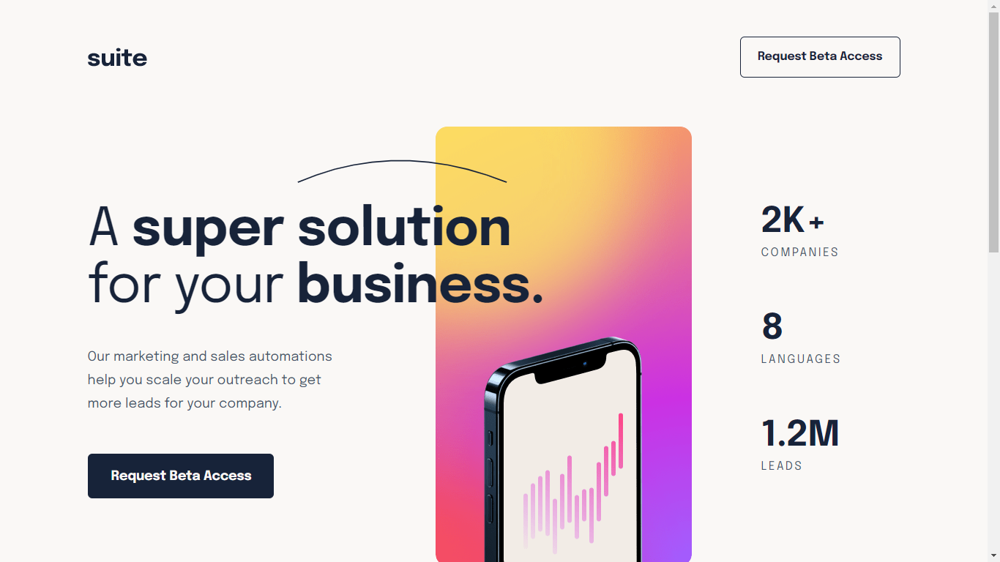
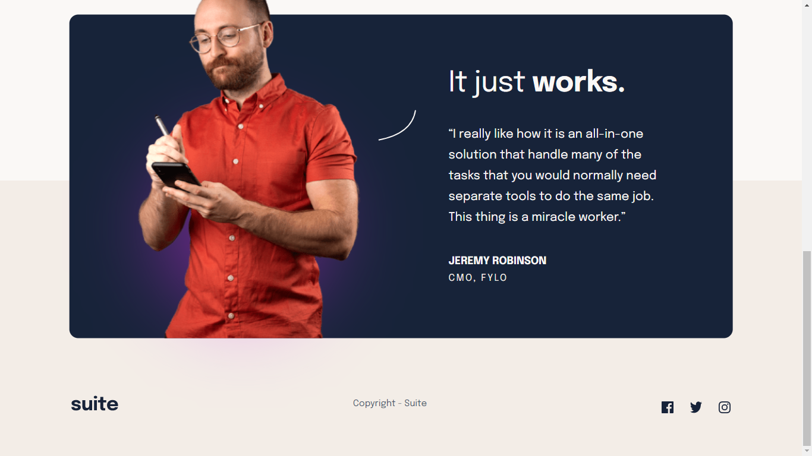

# Suite Landing Page

## Table of Contents
- [Overview](#overview)
- [Screenshot](#screenshot)
- [Languages](#Languages)
- [Steps](#Steps-To-Development)
- [Deployment](#deployed-link)

## Overview
Project objective is to build out this landing page and get it looking as close to the design
as possible.

Users should be able to:
1. View the optimal layout depending on their device's screen size
2. See hover states for interactive elements

## Screenshot

#### Languages 
- HTML5
- CSS
- JAVASCRIPT

## Steps To Development

1st march, 2023.
- Added Navigation and the Business info section
- Added a separate mobile and tablet CSS
- Added page default style for desktop.
- Deployed page to netlify

2nd march, 2023.
- Added Author and Footer HTML
- Added Author and Footer CSS
- Fixed responsiveness for all devices

3rd march, 2023.
- Fixed responsiveness
- Keep codes clean

5th march, 2023.
- Updated Responsiveness

## Deployed Link
Deployed link: https://da-suiteapppage.netlify.app/